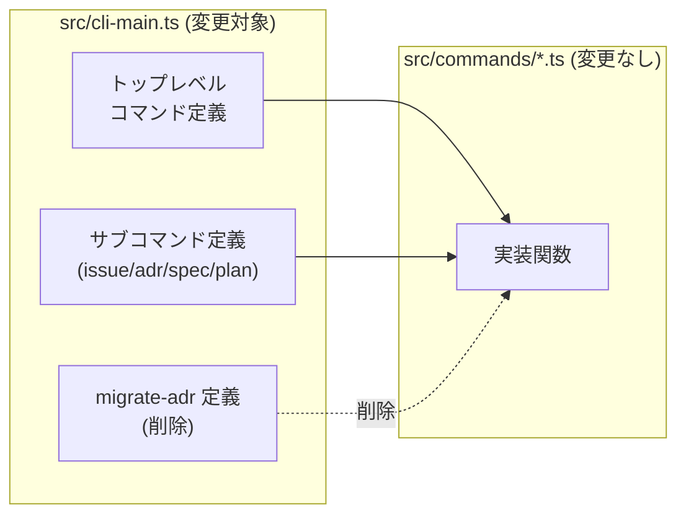

## Context (背景・現状・制約)

### 背景・動機

qtk はローカルリポジトリで issue / ADR / spec / plan を一元管理する CLI ツール（Bun ランタイム必須、citty フレームワーク使用）。日常的に使うサブコマンドが長く入力しづらく、入力効率の改善が求められている。

現在の課題は以下の3点:

1. **サブコマンドが長く入力しづらい** — `list`, `create`, `update` などを毎回フルスペルで打つ必要がある
2. **`new` と `create` が種別によって不統一** — ADR のみ `new`、issue/spec/plan は `create` となっており一貫性がない
3. **`migrate-adr` コマンドが不要** — Python 製 ADR CLI からの移行用コマンドだが、もう使用することがないため整理対象

### 現状

`src/cli-main.ts`（610行）が citty によるサブコマンド振り分けのエントリポイント。現在の構成:

**トップレベルコマンド**（10個、エイリアスなし）:
- `init`, `issue`, `adr`, `spec`, `plan`, `tags`, `search`, `graph`, `web`, `migrate-adr`

**種別別サブコマンド**:
| 種別 | サブコマンド |
|---|---|
| issue | `create`, `list`, `show`, `edit`, `archive`, `claim` |
| adr | `new`, `list`, `show`, `edit`, `tags`, `validate` |
| spec | `create`, `list`, `show`, `update` |
| plan | `create`, `list`, `show`, `edit`, `archive` |

- `meta.version` は `0.1.2`（src/cli-main.ts:593）
- package.json の `version` も `0.1.2`
- `migrate-adr` コマンド: import（42行目）、定義（566-588行目）、subCommands エントリ（606行目）、実体ファイル `src/commands/migrate-adr.ts`
- 関連 ADR: #0004「種別別サブコマンド設計 (qtk issue/adr/spec/plan)」（accepted）

### 制約事項

- **Bun ランタイム必須** — 実行環境は Bun
- **citty フレームワークの機能に依存** — エイリアスは citty の `meta.alias` 機能を使用する
- **後方互換性を維持** — `create` を `new` に改名するが、`create` はエイリアスとして残し既存スクリプト/CI を壊さない
- **バージョンはパッチアップ** — `0.1.2` → `0.1.3`（機能追加だが破壊的変更なし、パッチ扱い）
- **編集対象にスキルファイルが含まれる** — `masinc/skills` リポジトリ内の `skills/masinc/qtk/SKILL.md` / `skills/masinc/qtk/references/command-reference.md` も更新対象

## Goals (目的・ゴール・非ゴール・受け入れ基準)

### What

1. **トップレベルコマンドに短縮エイリアスを追加** — 入力しやすい2文字エイリアスを6個追加
2. **サブコマンドに短縮エイリアスを追加** — `list`→`ls`、`update`→`up`
3. **`new` をプライマリに統一** — issue/spec/plan の `create` を `new` に改名し、`create` をエイリアスとして残す。全種別で `new` がプライマリ、`create` がエイリアスの統一方針とする
4. **`migrate-adr` コマンドを削除** — import/定義/subCommands エントリ/実体ファイルを全て削除
5. **ドキュメント・スキルファイルを更新** — README.md、CHANGELOG.md、qtk スキルファイル（SKILL.md、command-reference.md）を現状に合わせる
6. **バージョンを 0.1.3 に更新** — cli-main.ts と package.json

### Why

- **入力効率の向上** — 日常的に頻繁に使うコマンド（`is ls`, `sp up`, `find`）を短縮形で打てるようにし、CLI の使い勝手を改善する
- **命名の一貫性** — ADR だけ `new`、他は `create` という不統一を解消し、全種別で `new` をプライマリに統一する。`create` は後方互換性のためエイリアスとして残す
- **不要コードの整理** — 使わなくなった `migrate-adr` を削除し、コードベースをクリーンに保つ

### 非ゴール

- **サブコマンドの機能変更・追加** — 既存サブコマンドの動作・引数・出力は変更しない（エイリアス追加と改名のみ）
- **`show`, `edit`, `archive`, `claim`, `validate`, `tags`(adr) のエイリアス追加** — これらは頻度が低い、または名前が短いため対象外
- **トップレベル `init`, `adr`, `web` のエイリアス追加** — 3文字のため短縮の意味が薄く対象外
- **リリース公開（npm publish）** — バージョン番号の更新と CHANGELOG 記載まで。publish はユーザーが別途行う
- **テストコードの追加・修正** — エイリアス/改名/削除は既存テストでカバーされる想定。必要なら検証タスクで追加

### 受け入れ基準 (Done の定義)

- [ ] `bun run typecheck` がパスする
- [ ] `bun test` がパスする
- [ ] トップレベルエイリアスが全て動作する: `bun run cli.ts is ls` / `bun run cli.ts sp ls` / `bun run cli.ts pl ls` / `bun run cli.ts tg` / `bun run cli.ts find "x"` / `bun run cli.ts fd "x"` / `bun run cli.ts gr`
- [ ] サブコマンドエイリアスが動作する: `bun run cli.ts issue ls` / `bun run cli.ts adr ls` / `bun run cli.ts spec ls` / `bun run cli.ts plan ls` / `bun run cli.ts spec up 1`
- [ ] `new` がプライマリで動作する: `bun run cli.ts issue new "test"` / `bun run cli.ts spec new "test"` / `bun run cli.ts plan new "test"` / `bun run cli.ts adr new "test"`
- [ ] `create` がエイリアスとして動作する: `bun run cli.ts issue create "test"` / `bun run cli.ts spec create "test"` / `bun run cli.ts plan create "test"` / `bun run cli.ts adr create "test"`
- [ ] `migrate-adr` が削除されている: `bun run cli.ts migrate-adr` でエラー（Unknown command）になること
- [ ] `bun run cli.ts --help` の表示にエイリアスが反映されている
- [ ] `bun run cli.ts issue --help` の表示に `new`(プライマリ) と `create`(alias) が表示される
- [ ] `meta.version` と package.json version が `0.1.3` になっている
- [ ] README.md のコマンド一覧が更新されている（`create`→`new`、エイリアス列、migrate-adr 行削除）
- [ ] CHANGELOG.md に `[0.1.3]` エントリが追加されている
- [ ] スキルファイル（SKILL.md、command-reference.md）が更新されている

## Design (設計方針・アーキテクチャ・データモデル)

### How

citty フレームワークの `meta.alias` 機能を使用してエイリアスを追加する。`defineCommand` の `meta` オブジェクトに `alias` プロパティを設定することで、citty がエイリアス名でもコマンドを解決する。

```typescript
// トップレベルコマンド例
const issueCmd = defineCommand({
  meta: { name: "issue", description: "チケット管理", alias: "is" },
  ...
});

// サブコマンド例（複数エイリアス）
const searchCmd = defineCommand({
  meta: { name: "search", description: "横断検索", alias: ["find", "fd"] },
  ...
});
```

`create` → `new` 改名は、`subCommands` オブジェクトのキーと `meta.name` を両方 `new` に変更することで実現する。`create` を `meta.alias` に指定すれば、従来の `create` 呼び出しも引き続き動作する。

### アーキテクチャ

変更は `src/cli-main.ts` のコマンド定義レイヤに集中し、各コマンドの実装関数（`src/commands/*.ts`）は変更しない。エイリアス/改名は citty のコマンド解決層で処理されるため、実装関数への影響はない。



### インターフェース・データモデル

#### トップレベルコマンドのエイリアス

| コマンド | エイリアス | 備考 |
|---|---|---|
| `init` | — | 不要 |
| `issue` | `is` | ユーザー指定 |
| `adr` | — | 3文字のため不要 |
| `spec` | `sp` | |
| `plan` | `pl` | ユーザー指定 |
| `tags` | `tg` | |
| `search` | `find`, `fd` | 両方追加（配列形式） |
| `graph` | `gr` | |
| `web` | — | 3文字のため不要 |

#### サブコマンドのエイリアス

| サブコマンド（プライマリ） | エイリアス | 対象コマンド | 備考 |
|---|---|---|---|
| `list` | `ls` | issue / adr / spec / plan | |
| `update` | `up` | spec | |
| `new` | `create` | issue / spec / plan | `create` から `new` に改名、`create` をエイリアスとして残す |
| `new` | `create` | adr | 元から `new`（変更なし）、`create` エイリアスを新規追加 |

#### 使用例

```bash
# どちらでも動く（全種別共通）
qtk issue new "タイトル"       # プライマリ
qtk issue create "タイトル"    # エイリアス
qtk adr new "ADR"             # プライマリ（従来通り）
qtk adr create "ADR"          # エイリアス（新規追加）
qtk spec new "仕様"           # プライマリ
qtk plan new "計画"           # プライマリ

# 短縮形
qtk is ls                     # issue list
qtk sp up 1 --content "..."   # spec update
qtk find "認証"               # search
qtk fd "認証"                 # search
qtk pl ls                     # plan list
qtk tg                        # tags
qtk gr                        # graph
```

### 代替案と却下理由

1. **全サブコマンドにエイリアスを追加** — `show`→`sh`, `edit`→`ed` 等
   - 却下理由: 頻度が低い、または名前が既に短いため ROI が低い。まず高頻度コマンド（list/update/create）に絞る
2. **`create` を完全に削除して `new` のみにする**
   - 却下理由: 既存スクリプト・CI・ドキュメントで `create` を使っている可能性があり、破壊的変更を避けるためエイリアスとして残す
3. **`migrate-adr` を deprecated 扱いにして残す**
   - 却下理由: もう使わないことが合意済み。deprecated 期間を設けるほどの利用実績がないため、完全削除する
4. **マイナーバージョンアップ（0.2.0）にする**
   - 却下理由: 破壊的変更なし（後方互換性維持）。エイリアス追加と不要コード削除のためパッチアップ（0.1.3）で十分

### 既存コードとの統合方針

- **citty の `meta.alias` 機能に従う** — フレームワークの標準的な方法でエイリアスを実装する
- **実装関数は変更しない** — `src/commands/*.ts` の各関数（createIssue, newAdr, createSpec, createPlan 等）はそのまま。関数名は `create*` のままだが、これは内部実装名であり CLI サブコマンド名とは独立
- **ADR #0004「種別別サブコマンド設計」を踏襲** — 種別別サブコマンド構成（issue/adr/spec/plan）は維持し、エイリアス追加のみ
- **後方互換性を最優先** — `create` は全種別でエイリアスとして残し、既存の呼び出しを壊さない

## Tasks (タスク一覧)

### Phase 1: コア実装（src/cli-main.ts）

- [ ] T01: `migrate-adr` コマンド削除
  - 依存: なし
  - 推定難易度: 低
  - 該当ファイル: `src/cli-main.ts`, `src/commands/migrate-adr.ts`
  - 作業内容:
    - `src/cli-main.ts:42` の `import { migrateAdr } from "./commands/migrate-adr";` を削除
    - `src/cli-main.ts:566-588` の `migrateAdrCmd` 定義を削除
    - `src/cli-main.ts:606` の `subCommands` 内 `"migrate-adr": migrateAdrCmd,` エントリを削除
    - `src/commands/migrate-adr.ts` ファイル自体を削除

- [ ] T02: トップレベルコマンドにエイリアス追加
  - 依存: なし
  - 推定難易度: 低
  - 該当ファイル: `src/cli-main.ts`
  - 作業内容: 各 `defineCommand` の `meta` に `alias` を追加
    - `issueCmd`: `meta: { name: "issue", description: "チケット管理", alias: "is" }`（45行目）
    - `specCmd`: `meta: { name: "spec", description: "仕様管理", alias: "sp" }`（311行目）
    - `planCmd`: `meta: { name: "plan", description: "計画管理", alias: "pl" }`（383行目）
    - `tagsCmd`: `meta: { name: "tags", description: "タグ一覧", alias: "tg" }`（485行目）
    - `searchCmd`: `meta: { name: "search", description: "横断検索", alias: ["find", "fd"] }`（497行目）
    - `graphCmd`: `meta: { name: "graph", description: "依存グラフ表示", alias: "gr" }`（533行目）

- [ ] T03: サブコマンド `list` に `ls` エイリアス追加
  - 依存: なし
  - 推定難易度: 低
  - 該当ファイル: `src/cli-main.ts`
  - 作業内容: issue/adr/spec/plan 各の `list` サブコマンド `meta` に `alias: "ls"` を追加
    - issue `list`（74行目）: `meta: { name: "list", description: "チケット一覧", alias: "ls" }`
    - adr `list`（217行目）: `meta: { name: "list", description: "ADR 一覧", alias: "ls" }`
    - spec `list`（332行目）: `meta: { name: "list", description: "仕様一覧", alias: "ls" }`
    - plan `list`（410行目）: `meta: { name: "list", description: "計画一覧", alias: "ls" }`

- [ ] T04: サブコマンド `update` に `up` エイリアス追加
  - 依存: なし
  - 推定難易度: 低
  - 該当ファイル: `src/cli-main.ts`
  - 作業内容: spec の `update` サブコマンド `meta` に `alias: "up"` を追加
    - spec `update`（361行目）: `meta: { name: "update", description: "仕様の本文を更新", alias: "up" }`

- [ ] T05: issue/spec/plan の `create` を `new` に改名 + `create` エイリアス追加
  - 依存: なし
  - 推定難易度: 中
  - 該当ファイル: `src/cli-main.ts`
  - 作業内容: 3種別それぞれで以下を変更
    - `subCommands` オブジェクトのキーを `create` から `new` に変更
    - `meta.name` を `create` から `new` に変更
    - `meta.alias` に `create` を追加
    - issue `create`（47-48行目）→ `new: defineCommand({ meta: { name: "new", description: "チケットを作成", alias: "create" }, ... })`
    - spec `create`（313-314行目）→ `new: defineCommand({ meta: { name: "new", description: "仕様を作成", alias: "create" }, ... })`
    - plan `create`（385-386行目）→ `new: defineCommand({ meta: { name: "new", description: "計画を作成", alias: "create" }, ... })`
  - 注意: 実装関数（`createIssue`, `createSpec`, `createPlan`）の名前は変更しない。CLI サブコマンド名のみ変更

- [ ] T06: adr の `new` に `create` エイリアス追加
  - 依存: なし
  - 推定難易度: 低
  - 該当ファイル: `src/cli-main.ts`
  - 作業内容: adr の `new` サブコマンド（194-195行目）の `meta` に `alias: "create"` を追加
    - `meta: { name: "new", description: "ADR を作成", alias: "create" }`

- [ ] T07: バージョンを 0.1.3 に更新
  - 依存: なし
  - 推定難易度: 低
  - 該当ファイル: `src/cli-main.ts`, `package.json`
  - 作業内容:
    - `src/cli-main.ts:593` の `version: "0.1.2"` → `version: "0.1.3"`
    - `package.json:3` の `"version": "0.1.2"` → `"version": "0.1.3"`

### Phase 2: ドキュメント更新

- [ ] T08: README.md 更新
  - 依存: T01, T02, T03, T04, T05, T06, T07
  - 推定難易度: 中
  - 該当ファイル: `README.md`
  - 作業内容:
    - コマンド一覧テーブル更新: `create`→`new`（プライマリ表示）、エイリアス列追加、`migrate-adr` 行削除
    - トップレベルエイリアス（is/sp/pl/tg/find/fd/gr）を記載
    - サブコマンドエイリアス（ls/up/create）を記載
    - クイックスタートの例を更新（`new` 使用例、短縮形例を追加）

- [ ] T09: CHANGELOG.md 更新
  - 依存: T07
  - 推定難易度: 低
  - 該当ファイル: `CHANGELOG.md`
  - 作業内容: 新エントリ `[0.1.3]` を追加
    - **Added**: トップレベルコマンド短縮エイリアス（is/sp/pl/tg/find/fd/gr）、サブコマンド短縮エイリアス（ls/up）、全種別で `create` エイリアス対応
    - **Changed**: issue/spec/plan の `create` サブコマンドを `new` に改名（`create` はエイリアスとして後方互換性維持）
    - **Removed**: `migrate-adr` コマンド（Python 製 ADR CLI からの移行用、不要のため削除）

- [ ] T10: qtk スキルファイル更新
  - 依存: T01, T02, T03, T04, T05, T06
  - 推定難易度: 中
  -   該当ファイル:
    - `masinc/skills` リポジトリ: `skills/masinc/qtk/SKILL.md`（クイックリファレンス）
    - `masinc/skills` リポジトリ: `skills/masinc/qtk/references/command-reference.md`（全コマンドリファレンス）
  - 作業内容:
    - SKILL.md のクイックリファレンス更新（`create`→`new`、エイリアス記載、migrate-adr 削除）
    - command-reference.md の全コマンドリファレンス更新（プライマリ/エイリアス明記、migrate-adr 削除）

### Phase 3: 検証

- [ ] T11: 静的解析・テスト実行
  - 依存: T01, T02, T03, T04, T05, T06, T07
  - 推定難易度: 低
  - 該当ファイル: （なし・検証のみ）
  - 作業内容:
    - `bun run typecheck` を実行しパスすることを確認
    - `bun test` を実行しパスすることを確認
    - 失敗した場合は原因を調査し修正（※ AGENTS.md の指示に従い debugger-flash エージェントに委譲）

- [ ] T12: 動作確認
  - 依存: T11
  - 推定難易度: 低
  - 該当ファイル: （なし・検証のみ）
  - 作業内容: 以下を全て実行し期待通り動作することを確認
    - トップレベルエイリアス: `bun run cli.ts is ls` / `bun run cli.ts sp ls` / `bun run cli.ts pl ls` / `bun run cli.ts tg` / `bun run cli.ts find "x"` / `bun run cli.ts fd "x"` / `bun run cli.ts gr`
    - サブコマンドエイリアス: `bun run cli.ts issue ls` / `bun run cli.ts spec up 1`（適当なspec ID）
    - new プライマリ: `bun run cli.ts issue new "test"` / `bun run cli.ts spec new "test"` / `bun run cli.ts plan new "test"` / `bun run cli.ts adr new "test"`
    - create エイリアス: `bun run cli.ts issue create "test"` / `bun run cli.ts spec create "test"` / `bun run cli.ts plan create "test"` / `bun run cli.ts adr create "test"`
    - help 表示: `bun run cli.ts --help` / `bun run cli.ts issue --help`（`new` プライマリ・`create` alias が表示されること）
    - migrate-adr 削除確認: `bun run cli.ts migrate-adr` で Unknown command エラーになること

## Risks (リスク・懸念・緩和策)

### リスク一覧

- **citty の `meta.alias` で複数エイリアス（配列）がサポートされない可能性**
  - 影響度: 中
  - 発生確率: 低
  - 緩和策: `search` コマンドに `find` と `fd` の2エイリアスを配列で指定する。citty の型定義・ドキュメントを確認し、配列形式がサポートされているか検証する。未サポートの場合は文字列で1つのみ指定し、`fd` は諦めるか別途対応を協議する

- **`create` → `new` 改名で既存スクリプト/CI/ドキュメントが壊れる**
  - 影響度: 高
  - 発生確率: 低
  - 緩和策: `create` を `meta.alias` として残すため、従来の `create` 呼び出しは引き続き動作する。後方互換性は維持される

- **`migrate-adr` 削除で利用中のユーザーが影響を受ける**
  - 影響度: 中
  - 発生確率: 低
  - 緩和策: もう使わないことが合意済み。CHANGELOG の Removed セクションに明記し、必要なら git 履歴から復元可能であることを記載

- **スキルファイル（外部パス）の編集権限**
  - 影響度: 低
  - 発生確率: 低
  - 緩和策: `masinc/skills` リポジトリ内の `skills/masinc/qtk/` 配下のファイルであり、実装エージェントがアクセス可能。アクセス不可の場合は本文更新のみ完了しスキル更新は別途対応とする

- **エイリアスが他のコマンド名/サブコマンド名と衝突する**
  - 影響度: 中
  - 発生確率: 低
  - 緩和策: 追加するエイリアス（is/sp/pl/tg/find/fd/gr/ls/up/create）は既存のコマンド名・サブコマンド名と重複しないことを確認済み。`find`/`fd` は検索系の一般的な名前だが、qtk には同名コマンド/サブコマンドは存在しない

## References (参考リンク・関連ファイル)

### 関連 ADR
- ADR #0004: 種別別サブコマンド設計 (qtk issue/adr/spec/plan) — accepted — 本計画の基礎となるサブコマンド設計方針

### 編集対象ファイル
- `src/cli-main.ts` — CLI エントリポイント（コア変更：エイリアス追加、create→new 改名、migrate-adr 削除、バージョン更新）
- `src/commands/migrate-adr.ts` — 削除対象ファイル
- `package.json` — バージョン更新（0.1.2 → 0.1.3）
- `README.md` — コマンド一覧・クイックスタート更新
- `CHANGELOG.md` — [0.1.3] エントリ追加
- `masinc/skills` リポジトリ: `skills/masinc/qtk/SKILL.md` — クイックリファレンス更新
- `masinc/skills` リポジトリ: `skills/masinc/qtk/references/command-reference.md` — 全コマンドリファレンス更新

### 調査結果のまとめ（2026-08-15 現状）
- `src/cli-main.ts` は610行、citty の `defineCommand` でトップレベル10コマンド + 種別別サブコマンドを定義
- 現状エイリアスは一切なし。`meta.alias` プロパティは未使用
- `migrate-adr` は import(42行目) / 定義(566-588行目) / subCommands エントリ(606行目) の3箇所 + 実体ファイル `src/commands/migrate-adr.ts`
- issue/adr/spec/plan は全て独立した `defineCommand` として定義され、それぞれ `subCommands` を持つ
- 実装関数（`createIssue`, `newAdr`, `createSpec`, `createPlan` 等）は `src/commands/*.ts` に配置。CLI サブコマンド名変更は実装関数名に影響しない
