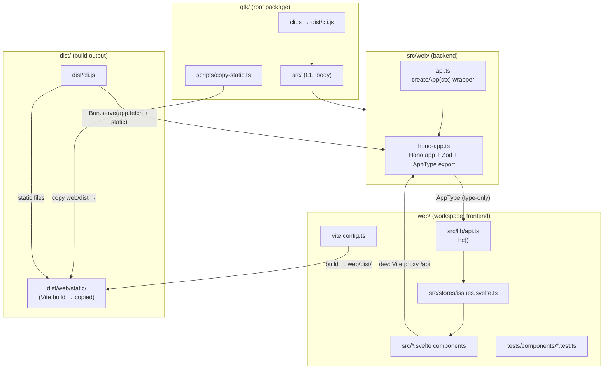

## Context (背景・現状・制約)

### 背景・動機

qtk はローカルで issue / ADR / spec / plan を一元管理する CLI ツール（Bun + TypeScript）。`qtk web` サブコマンドはローカル専用の Kanban Web UI を提供するが、現在は **単一 HTML ファイル（385行）に CSS/JS を全てインライン埋め込み**した素の vanilla JS 実装で、バックエンドも `Bun.serve` 上で **正規表現による手書きルーティング** を行っている。

この構成には以下の課題がある:

1. **フロントエンドの保守性が限界** — CSS 146行 + JS 175行が1ファイルに埋め込まれ、`innerHTML` による文字列組み立てと手書き `escapeHtml()` でレンダリングしている。コンポーネント分割・状態管理・スタイルのスコープ化が一切ない
2. **バックエンドの型安全性が皆無** — `handleApi()` は `req.json() as { title?: string }` のようなキャスト頼りで、リクエストボディのバリデーションが `if (!body.title)` の一点チェックのみ。ルーティングも正規表現マッチ (`path.match(/^\/api\/issues\/(\d+)\/edit$/)`) で脆い
3. **前後間の型共有がない** — API のリクエスト/レスポンス型がフロントとバックで重複定義（実際はフロント側には型自体存在しない）。API 変更時に両側を手作業で追従する必要がある
4. **テスト基盤が API のみ** — `tests/integration/phase3.test.ts` が `handleApi()` を直接呼ぶ E2E テストのみで、フロントエンドのコンポーネントテストは存在しない
5. **UI/UX の拡張余地が小さい** — issue #0015「Web API に ADR/Spec/Plan エンドポイント追加」を見据えると、4種別のレコードを扱う UI を素の HTML 文字列組み立てで拡張するのは現実的でない

本計画は、これらを解決するため **バックエンドを Hono + Zod に、フロントエンドを Svelte 5 + Vite + Tailwind v4 + daisyUI 5 に移行** し、型安全な RPC（hono/client）とコンポーネントテスト基盤（Vitest + @testing-library/svelte）を整備する。技術スタックはユーザーとの事前協議で確定済み（後述の Design セクション参照）。

### 現状

#### バックエンド（`src/web/api.ts` / `src/commands/web.ts`）

- **`src/web/api.ts`**（103行）— `handleApi(ctx, req): Promise<Response>` を export。`WebContext { storeDir, config }` を受け取り、`new URL(req.url)` → `path` で手書き分岐:
  - `GET /api/issues` — `listIssueFiles` → frontmatter + body + `idLabel` を結合し `id` 昇順ソート
  - `POST /api/issues` — `createIssue` 呼び出し（`title` 必須チェックのみ）
  - `POST /api/issues/:id/edit` — 正規表現 `path.match(/^\/api\/issues\/(\d+)\/edit$/)` で ID 抽出、`editIssue` 呼び出し
  - `POST /api/issues/:id/claim` — 正規表現マッチ、`claimIssue` を try/catch で 409 変換
  - 404 は `jsonResponse({ error: "Not Found" }, 404)`
- **`src/commands/web.ts`**（71行）— `startWeb(options)` が `Bun.serve` を起動。`/api/*` は `handleApi` へ、それ以外は `STATIC_DIR`（`existsSync` フォールバックで `dist/web/static` → `src/web/static` を探索）から静的ファイル配信。`--no-open` でなければ Windows の `cmd /c start` でブラウザオープン。ポートは `--port` 指定時のみ固定、省略時は `port: 0` で OS 自動割り当て（plan #0020 で修正済み）
- **依存するコマンド実装** — `src/commands/issue.ts` が `listIssueFiles`, `findIssue`, `createIssue`, `editIssue`, `claimIssue` を提供。`src/models/id.ts` の `formatId(id, config)` で `#0001` 形式の idLabel を生成
- **データ型** — `src/models/types.ts` に `Issue extends BaseRecord`（`status: "new" | "in-progress" | "paused" | "done"`、`tags: string[]`、`claimed_by: string | null`、`comments: Comment[]` 等）。`BaseRecord` はインデックスシグネチャ `[key: string]: unknown` を持ち未知フィールドを許容

#### フロントエンド（`src/web/static/index.html`）

- 単一 HTML（385行）。`<style>` 146行（CSS 変数でカラーテーマ、`.column` / `.card` / `.modal` / `.toast` 等）+ `<script>` 175行
- 状態は `let issues = []`（グローバル変数）、`let currentDetailId = null`
- レンダリングは `board.innerHTML = ""` → `createElement` + `innerHTML` 文字列組み立て。`escapeHtml()` で XSS 対策
- 機能: 4カラム Kanban（new / in-progress / paused / done）、ドラッグ&ドロップ（HTML5 DnD API）、作成モーダル（title/description/tags）、詳細モーダル（status/description/comment）、トースト通知、日本語 UI
- `api(path, options)` ヘルパーで `fetch` + JSON パース + エラーハンドリング

#### ビルド・テスト

- **ビルド** — `package.json` の `scripts.build`: `bun build cli.ts --outdir dist --target bun && bun run scripts/copy-static.ts`。`scripts/copy-static.ts`（14行）は `src/web/static/*` を `dist/web/static/` へコピー
- **パッケージ構成** — `files: ["dist/", "dist/web/static/", "src/", "README.md", "LICENSE", "CHANGELOG.md"]`。`bin: { "qtk": "dist/cli.js" }`。`prepublishOnly: "bun test && bun run typecheck && bun run build"`
- **テスト** — `bun test` で `tests/` 配下を実行。`tests/integration/phase3.test.ts`（82行）は `handleApi()` を直接呼び出す 5テスト:
  - `GET /api/issues`（一覧取得、idLabel 検証）
  - `POST /api/issues`（作成、ステータス 201 検証）
  - `POST /api/issues/:id/edit`（ステータス更新）
  - `POST /api/issues/:id/claim`（クレーム、claimed_by 検証）
  - 404 ハンドリング（`/api/unknown`）
- **依存関係** — root `package.json` の dependencies は `citty`, `cli-table3`, `proper-lockfile` のみ。devDependencies は `@types/bun`, `@types/proper-lockfile`, `typescript`。フロントエンド依存は皆無
- **tsconfig.json** — `strict: true`, `moduleResolution: "bundler"`, `verbatimModuleSyntax: true`, `noUncheckedIndexedAccess: true`, `types: ["bun"]`
- **ランタイム** — Bun 1.3.14 / Windows (win32) / PowerShell 5.1

### 制約事項

- **OS**: Windows (win32)、PowerShell 5.1。シェル固有コマンド（`cp` 等）は使わず Bun API でクロスプラットフォーム対応
- **ランタイム**: Bun 必須。ビルドスクリプトも Bun で実行
- **言語**: TypeScript 全面採用。`strict: true` を維持
- **ローカル専用**: `127.0.0.1` のみ、単一ユーザー、LAN 非公開。認証・CORS・HTTPS は不要
- **既存テストの保持**: `tests/integration/phase3.test.ts` は `handleApi()` を直接呼ぶ形だが、Hono 移行後に `app.request()` ベースに調整が必要。テストの意図（各エンドポイントの振る舞い検証）は維持する
- **npm publish 互換**: `package.json` の `files` に `dist/web/static/` が含まれており、ビルド済み `dist/cli.js` 経由で `bunx @masinc/qtk` 実行時に静的ファイルが配信される仕組みは維持する
- **AGENTS.md ルール**:
  - lint/typecheck/test/build の実行は debugger-flash エージェントに委譲（直接 bash で叩かない）
  - ブラウザデバッグ (playwright-cli) は vision-flash エージェントに委譲
  - `bun publish` コマンドはユーザーに依頼
  - plan/spec/issue/adr は qtk CLI で管理
- **コードコメント**: 明示的に求められない限りコメントを書かない（既存コードも冒頭1行のファイルヘッダのみ）
- **package.json の files**: root は `dist/` を含むため、`web/dist/` を新設しても npm tarball には含まれない。ビルド時に `web/dist/` を `dist/web/static/` へコピーする仕組みは維持する

## Goals (目的・ゴール・非ゴール・受け入れ基準)

### What

1. **Bun workspaces モノレポ化** — `web/` サブディレクトリを新設し、root `package.json` の `workspaces: ["web"]` でフロントエンド依存を隔離する
2. **バックエンドを Hono + Zod に移行** — `src/web/api.ts` を Hono アプリ + `@hono/zod-validator` による Zod バリデーションに書き換え、`hono/client` が型推論できるように app 型を export する
3. **フロントエンドを Svelte 5 + Vite に移行** — `web/` に Vite + Svelte 5 + Tailwind v4 + daisyUI 5 の SPA を構築し、既存 index.html の全機能をコンポーネント分割で再現する
4. **型安全な RPC** — `hono/client` の `hc<AppType>()` でフロントエンドからバックエンドへ型安全な API コールを実現する
5. **runes による状態管理** — `web/src/stores/issues.svelte.ts` で Svelte 5 runes（`$state`, `$derived`）を使った状態管理を行う
6. **コンポーネントテスト基盤** — `web/` 内に Vitest + @testing-library/svelte を設定し、主要コンポーネントのテストを書く
7. **既存テストの維持** — `tests/integration/phase3.test.ts` を Hono app に合わせて調整し、テストの意図を維持する
8. **ビルド・配信の維持** — `bun run build` で `web/dist/` をビルドし `dist/web/static/` へコピー、Hono から静的配信する仕組みを維持する

### Why

- **保守性の向上** — コンポーネント分割・スコープ CSS・型安全な状態管理により、UI 拡張（issue #0015 の ADR/Spec/Plan 対応等）のコストを下げる
- **型安全性** — Hono + Zod + hono/client でリクエスト/レスポンスの型をフロント・バック間で一元化し、API 変更時の型不整合をコンパイル時に検出する
- **DX の向上** — Vite の HMR でフロントエンド開発を高速化し、daisyUI で一貫した UI コンポーネントを得る
- **テスト容易性** — コンポーネントテストを書ける基盤を整え、リグレッションリスクを下げる

### 非ゴール

- **ADR/Spec/Plan エンドポイントの追加** — issue #0015 のスコープ。本計画では issues API の移行のみ。API 構造を Hono にするだけで後続追加は容易になる前提
- **Mac/Linux のブラウザ自動オープン対応** — issue #0008 のスコープ。本計画では Windows の既存動作を維持するのみ
- **既存 `bun test` の Vitest 統一** — 既存の `bun test`（API/CLI/store、`bun:test` 依存）はそのまま Bun で維持。フロントエンドテストのみ `web/` 内の Vitest で実行する（ユーザー確認済み・分離案）
- **OpenAPI 仕様書の生成** — `@hono/zod-openapi` は使わず、軽量な `zod-validator` を採用（ユーザー確認済み）。API ドキュメント自動生成は別スコープ
- **認証・CORS・HTTPS** — ローカル専用のため不要
- **SvelteKit の導入** — SvelteKit は Bun アダプタ（`svelte-adapter-bun`、更新停止）に依存するため却下。Svelte + Vite standalone で十分（ユーザー確認済み）
- **npm publish** — バージョン番号更新と CHANGELOG 記載まで。publish はユーザーが別途行う
- **PWA / オフライン対応** — 不要
- **i18n の多言語化** — 日本語 UI のみ維持

### 受け入れ基準 (Done の定義)

- [ ] `web/` ディレクトリが存在し、root `package.json` の `workspaces: ["web"]` が設定されている
- [ ] `bun install` がモノレポ全体で成功する（root + web workspace の依存が解決される）
- [ ] `src/web/hono-app.ts` が Hono アプリ（`Hono` インスタンス）を export し、`export type AppType = typeof app` で RPC 型を公開している
- [ ] `src/web/api.ts` が Hono アプリを `Bun.serve` に渡す形に書き換わっている（手書きルーティングが消滅）
- [ ] 全4エンドポイント（`GET /api/issues`, `POST /api/issues`, `POST /api/issues/:id/edit`, `POST /api/issues/:id/claim`）が Hono ルートとして定義され、Zod スキーマでリクエストボディをバリデーションしている
- [ ] 無効なリクエストボディで Zod バリデーションエラー（400）が返る
- [ ] `tests/integration/phase3.test.ts` が `app.request()` ベースに書き換わり、5テスト全てがパスする
- [ ] `web/src/lib/api.ts` が `hc<AppType>()` で型安全な API クライアントを export している
- [ ] `web/` に Svelte 5 コンポーネント（Board, Column, Card, CreateModal, DetailModal, Toast）が存在し、既存 index.html の全機能（4カラム表示、DnD、作成/詳細モーダル、トースト、日本語 UI）が再現されている
- [ ] `web/src/stores/issues.svelte.ts` が runes（`$state`, `$derived`）で issues 状態を管理している
- [ ] `web/` に Tailwind v4 + daisyUI 5 が設定され、daisyUI コンポーネントクラス（`btn`, `modal`, `card`, `badge` 等）が使われている
- [ ] `web/vite.config.ts` が Vite + Svelte + Tailwind + `@tailwindcss/vite` プラグイン + `/api` プロキシ（→ `localhost:3000`）を設定している
- [ ] `web/` 内で `bun run dev`（Vite dev server, 5173）と `bun run cli.ts web --no-open`（Hono API, 3000）の2プロセス起動で開発できる（Vite が `/api` をプロキシ）
- [ ] `web/` 内で `bun run test`（Vitest）が実行でき、主要コンポーネントのテストがパスする
- [ ] `bun run build` で `web/dist/` に Vite ビルド成果物が生成され、`scripts/copy-static.ts` で `dist/web/static/` へコピーされる
- [ ] ビルド済み `dist/cli.js` で `bun dist/cli.js web --no-open` を実行すると、Hono が API と静的ファイル（`dist/web/static/`）を両方配信する
- [ ] `bun test`（既存、API/CLI/store）が全てパスする（回帰なし）
- [ ] `bun run typecheck`（root）がパスする
- [ ] `npm pack --dry-run` で tarball に `dist/web/static/` が含まれる

## Design (設計方針・アーキテクチャ・データモデル)

### How

#### 全体方針

バックエンドとフロントエンドを明確に分離しつつ、型を共有する:

1. **バックエンド**（`src/web/`）— Hono アプリを定義し `app` インスタンスと `AppType`（`typeof app`）を export。`src/commands/web.ts` は `Bun.serve` に `app.fetch` を渡し、`/api/*` は Hono、それ以外は静的ファイル配信
2. **フロントエンド**（`web/`）— Vite + Svelte 5 で SPA を構築。`hono/client` の `hc<AppType>()` でバックエンドと型共有。Vite dev 時は `/api` を Hono（localhost:3000）へプロキシ
3. **型の流れ** — `src/web/hono-app.ts` の `AppType` を `web/src/lib/api.ts` が import し `hc<AppType>()` でクライアント生成。`import type` で型のみ参照するため実行時依存は発生しない

#### 技術スタック（ユーザー確認済み・npm 最新版で調査）

| レイヤー | 技术 | バージョン | 役割 |
|---|---|---|---|
| バックエンド | Hono | 4.13.2 | API ルーティング、Bun.serve 上で app.fetch |
| バリデーション | @hono/zod-validator + Zod | zod-validator 最新 / Zod 4.4.3 | リクエストボディ/パラメータの型検証 |
| RPC クライアント | hono/client | Hono 同梱 | 型安全な API コール（`hc<AppType>()`） |
| フロントエンド | Svelte 5 | 5.56.9 | SPA、runes で状態管理 |
| バンドラ | Vite | 7系（@sveltejs/vite-plugin-svelte 経由） | ビルド・dev server・HMR |
| スタイリング | Tailwind CSS v4 + daisyUI 5 | @tailwindcss/vite 4.3.3 / daisyUI 5.7.17 | daisyUI コンポーネント（btn, modal, card, badge 等） |
| テスト | Vitest + @testing-library/svelte | Vitest 4.1.10 / testing-library/svelte 5.4.2 | コンポーネントテスト（jsdom 環境） |
| DnD | svelte-dnd-action | 最新 | ドラッグ&ドロップ（タッチ対応・アニメーション付き） |
| 構成 | Bun workspaces | Bun 1.3.14 | `web/` サブディレクトリで依存隔離 |

#### バックエンド移行の詳細

`src/web/hono-app.ts`（新規）に Hono アプリを定義する。`WebContext` を Hono の Variables（`c.set('ctx', ctx)`）またはクロージャで渡す。Zod スキーマで各エンドポイントのリクエストボディを定義し、`zValidator('json', schema)` でミドルウェア適用。

```ts
// src/web/hono-app.ts (新規・イメージ)
import { Hono } from "hono";
import { zValidator } from "@hono/zod-validator";
import { z } from "zod";
import type { WebContext } from "./api";
import { createIssue, listIssueFiles, editIssue, claimIssue, findIssue } from "../commands/issue";
import { formatId } from "../models/id";

const createIssueSchema = z.object({
  title: z.string().min(1, "title は必須です"),
  description: z.string().optional(),
  tags: z.array(z.string()).optional(),
});

const editIssueSchema = z.object({
  status: z.string().optional(),
  description: z.string().optional(),
  addTags: z.array(z.string()).optional(),
  removeTags: z.array(z.string()).optional(),
  comment: z.string().optional(),
});

const claimSchema = z.object({
  as: z.string().optional(),
});

export function createApp(ctx: WebContext) {
  const app = new Hono();

  app.get("/api/issues", async (c) => {
    const files = await listIssueFiles(ctx.storeDir);
    const issues = files.map((f) => ({
      ...f.record.frontmatter,
      body: f.record.body,
      idLabel: formatId(f.record.frontmatter.id as number, ctx.config),
    }));
    issues.sort((a, b) => (a.id as number) - (b.id as number));
    return c.json({ issues });
  });

  app.post("/api/issues", zValidator("json", createIssueSchema), async (c) => {
    const body = c.req.valid("json");
    const { id } = await createIssue(ctx.storeDir, ctx.config, body);
    return c.json({ id, idLabel: formatId(id, ctx.config) }, 201);
  });

  app.post("/api/issues/:id/edit", zValidator("json", editIssueSchema), async (c) => {
    const id = parseInt(c.req.param("id"), 10);
    const found = await findIssue(ctx.storeDir, id);
    if (!found) return c.json({ error: "issue が見つかりません" }, 404);
    const body = c.req.valid("json");
    await editIssue(ctx.storeDir, ctx.config, id, body);
    return c.json({ ok: true, id });
  });

  app.post("/api/issues/:id/claim", zValidator("json", claimSchema), async (c) => {
    const id = parseInt(c.req.param("id"), 10);
    const body = c.req.valid("json");
    try {
      await claimIssue(ctx.storeDir, ctx.config, id, { as: body.as });
      return c.json({ ok: true, id });
    } catch (err) {
      return c.json({ error: (err as Error).message }, 409);
    }
  });

  return app;
}

export type App = ReturnType<typeof createApp>;
```

`src/web/api.ts` は `createApp(ctx)` を呼び出して Hono アプリを生成し、`src/commands/web.ts` は `app.fetch` を `Bun.serve` の `fetch` に渡す。404 やエラーレスポンスの JSON 形式は既存の `{ error: string }` を維持し、フロントエンドのエラーハンドリングを壊さない。

`phase3.test.ts` は `handleApi(ctx, req)` → `createApp(ctx).request(url, init)` に書き換える。Hono の `app.request()` は `Request` を受け取り `Response` を返すため、テストの構造（Request 生成 → レスポンス検証）はそのまま維持できる。

#### フロントエンド移行の詳細

`web/` ディレクトリに独立した `package.json` を置き、Vite + Svelte 5 + Tailwind v4 + daisyUI 5 をインストールする。`vite.config.ts` で `@sveltejs/vite-plugin-svelte` と `@tailwindcss/vite` を有効化し、`server.proxy` で `/api` を `localhost:3000` へ転送する。

`web/src/app.css` に Tailwind と daisyUI の import を置く:

```css
@import "tailwindcss";
@plugin "daisyui";
```

`web/src/lib/api.ts` で `hono/client` の型安全クライアントを生成する:

```ts
// web/src/lib/api.ts
import { hc } from "hono/client";
import type { App } from "../../../src/web/hono-app";

export const api = hc<App>("/");
```

`web/src/stores/issues.svelte.ts` で runes による状態管理を行う:

```ts
// web/src/stores/issues.svelte.ts (イメージ)
import { api } from "../lib/api";

class IssueStore {
  issues = $state<Issue[]>([]);
  loading = $state(false);

  columns = $derived([
    { status: "new", label: "New", items: this.issues.filter((i) => i.status === "new") },
    { status: "in-progress", label: "In Progress", items: this.issues.filter((i) => i.status === "in-progress") },
    { status: "paused", label: "Paused", items: this.issues.filter((i) => i.status === "paused") },
    { status: "done", label: "Done", items: this.issues.filter((i) => i.status === "done") },
  ]);

  async load() {
    this.loading = true;
    const res = await api.api.issues.$get();
    const data = await res.json();
    this.issues = data.issues;
    this.loading = false;
  }

  async create(input: { title: string; description?: string; tags?: string[] }) {
    const res = await api.api.issues.$post({ json: input });
    if (!res.ok) throw new Error((await res.json()).error);
    await this.load();
  }

  async updateStatus(id: number, status: string) {
    const res = await api.api.issues[":id"].edit.$post({ param: { id: String(id) }, json: { status } });
    if (!res.ok) throw new Error((await res.json()).error);
    await this.load();
  }
}

export const issueStore = new IssueStore();
```

DnD は `svelte-dnd-action` を使い、`Column.svelte` のカードリストに `use:dnd` アクションを適用する。タッチデバイス対応とアニメーションが標準で付属する。

### アーキテクチャ



**開発時**:
- `bun --filter web run dev` → Vite dev server (5173) + HMR
- `bun run cli.ts web --no-open` → Hono API (3000)
- Vite が `/api/*` を `localhost:3000` へプロキシ

**本番ビルド時**:
- `bun --filter web run build` → Vite build → `web/dist/`
- `bun run build` → `bun build cli.ts` + `scripts/copy-static.ts`（`web/dist/` → `dist/web/static/`）
- `dist/cli.js` が Hono（API）+ 静的ファイル配信（`dist/web/static/`）を両方担当

### インターフェース・データモデル

#### API エンドポイント（移行後・Hono 定義）

| Method | Path | Zod スキーマ | レスポンス | ステータス |
|---|---|---|---|---|
| GET | `/api/issues` | — | `{ issues: Issue[] }` | 200 |
| POST | `/api/issues` | `createIssueSchema` | `{ id: number, idLabel: string }` | 201 |
| POST | `/api/issues/:id/edit` | `editIssueSchema` | `{ ok: true, id: number }` | 200 / 404 |
| POST | `/api/issues/:id/claim` | `claimSchema` | `{ ok: true, id: number }` | 200 / 409 |

Zod バリデーションエラー時は `zValidator` が自動的に 400 `{ success: false, error: ZodError }` を返す。フロントエンドは `res.ok` で判定しエラーメッセージを抽出する。

#### Issue 型（フロントエンド共有）

```ts
// web/src/lib/types.ts
export interface Issue {
  id: number;
  idLabel: string;
  title: string;
  description: string;
  status: "new" | "in-progress" | "paused" | "done";
  tags: string[];
  claimed_by: string | null;
  body: string;
  [key: string]: unknown;
}
```

`hono/client` の `hc<AppType>()` がレスポンス型を推論するため、手書きは不要だが、コンポーネントの props 型明示用に `types.ts` で再エクスポートする。

#### フロントエンド package.json（`web/package.json`）

```json
{
  "name": "@masinc/qtk-web",
  "private": true,
  "type": "module",
  "scripts": {
    "dev": "vite",
    "build": "vite build",
    "preview": "vite preview",
    "test": "vitest run",
    "test:watch": "vitest"
  },
  "devDependencies": {
    "@sveltejs/vite-plugin-svelte": "^5.0.0",
    "@tailwindcss/vite": "^4.3.0",
    "@testing-library/svelte": "^5.4.0",
    "@testing-library/jest-dom": "^6.0.0",
    "@types/svelte-dnd-action": "^5.0.0",
    "daisyui": "^5.7.0",
    "jsdom": "^26.0.0",
    "svelte": "^5.56.0",
    "svelte-dnd-action": "^0.9.0",
    "tailwindcss": "^4.3.0",
    "vite": "^7.0.0",
    "vitest": "^4.1.0"
  },
  "dependencies": {
    "hono": "^4.13.0"
  }
}
```

`hono` は `web/` の dependencies に入れる（`hono/client` をフロントエンドで import するため）。root の dependencies にも `hono`, `@hono/zod-validator`, `zod` を追加する。

#### vite.config.ts（`web/vite.config.ts`）

```ts
import { defineConfig } from "vite";
import { svelte } from "@sveltejs/vite-plugin-svelte";
import tailwindcss from "@tailwindcss/vite";

export default defineConfig({
  plugins: [svelte(), tailwindcss()],
  server: {
    proxy: {
      "/api": "http://localhost:3000",
    },
  },
  test: {
    environment: "jsdom",
    globals: true,
    setupFiles: ["./tests/setup.ts"],
  },
});
```

### 代替案と却下理由

#### バックエンド

- **Elysia 代替** — 却下。破壊的変更が頻繁（ユーザー確認済み）。Hono はエコシステム最大・API 安定・Zod 統合が標準
- **@hono/zod-openapi 代替** — 却下。OpenAPI 仕様書生成は別スコープ。軽量な `zod-validator` で十分（ユーザー確認済み）
- **Bun.serve の手書きルーティング維持** — 却下。正規表現マッチが脆く、バリデーションが手書き。Hono でルーティング・バリデーション・型共有を一括解決
- **express 代替** — 却下。Bun 上で Web 標準 API ベースの Hono が最適。express は Node.js 依存

#### フロントエンド

- **SvelteKit 代替** — 却下。Bun アダプタ（`svelte-adapter-bun`、2025年9月更新停止）に依存。`adapter-static` は動的 API ルート非対応。Svelte + Vite standalone はアダプタ不要で Vite ビルド成果物を Hono が配信すればよい（ユーザー確認済み）
- **React / Preact / Solid 代替** — 却下。ユーザーが明示的に Svelte を指定。daisyUI 5 は Tailwind プラグインでフレームワーク非依存のため Svelte でも問題なし
- **Tailwind v3 代替** — 却下。v4 は `@tailwindcss/vite` プラグインで PostCSS 設定不要・設定ファイル不要（CSS import のみ）。daisyUI 5 も v4 対応
- **CSS Modules / styled-components 代替** — 却下。daisyUI 5 のコンポーネントクラスを活用するため Tailwind v4 + daisyUI 5 を採用

#### DnD

- **HTML5 DnD API 維持** — 却下。タッチデバイス非対応・アニメーションなし。`svelte-dnd-action` で両方を解決（ユーザー確認済み）

#### テスト

- **全テストを Vitest に統一** — 却下。既存の `bun:test` 依存テスト（phase1/2/3 等）全ての移行が発生しスコープ膨大。フロントエンドテストのみ `web/` 内の Vitest で分離（ユーザー確認済み・分離案）
- **Playwright E2E テスト** — 却下。ローカル単一ユーザー用途ではコンポーネントテストで十分。E2E は別スコープ

#### 構成

- **単一 package.json でフロント依存も混入** — 却下。Vite/Svelte/Tailwind/daisyUI/Vitest 等のフロント依存が CLI パッケージの `devDependencies` に混入し、`npm install` 時に不要な依存まで入る。Bun workspaces で `web/` を分離し、CLI パッケージをクリーンに保つ

### 既存コードとの統合方針

- **`src/commands/issue.ts` は変更しない** — `listIssueFiles`, `findIssue`, `createIssue`, `editIssue`, `claimIssue` のシグネチャ・挙動はそのまま。Hono ハンドラからこれらを呼び出す
- **`src/models/types.ts`, `src/models/id.ts` は変更しない** — `Issue`, `Config`, `formatId` はそのまま利用
- **`src/commands/web.ts` の `startWeb()` シグネチャは維持** — `WebOptions { port?, noOpen?, dir? }` と `cli-main.ts:556-562` の呼び出しは変更なし。内部実装のみ Hono app に差し替え
- **静的ファイル配信のフォールバックは維持** — `STATIC_DIR_CANDIDATES`（`dist/web/static` → `src/web/static` の `existsSync` フォールバック、plan #0020 で確立）を `dist/web/static` → `web/dist` に調整。`scripts/copy-static.ts` は `web/dist/` を `dist/web/static/` へコピーするよう変更
- **`package.json` の `files` は維持** — `dist/web/static/` が npm tarball に含まれる仕組みはそのまま
- **既存テストの意図は維持** — `phase3.test.ts` の5テスト（GET/POST/edit/claim/404）は Hono の `app.request()` に書き換えるが、検証内容（ステータスコード、JSON ボディ、findIssue での永続化確認）は同じ
- **`cli-main.ts` の `webCmd` は変更不要** — `startWeb()` 呼び出しのインターフェースが変わらないため

## Tasks (タスク一覧)

### Phase 1: モノレポ基盤セットアップ

- [ ] T01: root `package.json` に `workspaces` フィールドを追加
  - 依存: なし
  - 推定難易度: 低
  - 該当ファイル: `package.json`
  - 作業内容:
    - `"workspaces": ["web"]` を追加（トップレベル）
    - dependencies に `hono`, `@hono/zod-validator`, `zod` を追加（バックエンド用）
    - `scripts.build` は後続タスクで調整
  - 備考: Bun v1.3+ は isolated installs がデフォルト。`bun install` で `web/` も解決される

- [ ] T02: `web/package.json` を新規作成
  - 依存: T01
  - 推定難易度: 低
  - 該当ファイル: `web/package.json`（新規）
  - 作業内容:
    - Design セクションの `web/package.json` 雛形を配置
    - `name: "@masinc/qtk-web"`, `private: true`
    - scripts: `dev`, `build`, `preview`, `test`, `test:watch`
    - devDependencies: `@sveltejs/vite-plugin-svelte`, `@tailwindcss/vite`, `@testing-library/svelte`, `@testing-library/jest-dom`, `daisyui`, `jsdom`, `svelte`, `svelte-dnd-action`, `tailwindcss`, `vite`, `vitest`
    - dependencies: `hono`（hono/client 用）

- [ ] T03: `web/` の初期ディレクトリ構造を作成
  - 依存: T02
  - 推定難易度: 低
  - 該当ファイル: `web/index.html`, `web/src/main.ts`, `web/src/app.css`, `web/src/App.svelte`, `web/src/lib/`, `web/src/components/`, `web/src/stores/`, `web/tests/`
  - 作業内容:
    - `web/index.html` — Vite エントリ（`<div id="app"></div>` + `<script type="module" src="/src/main.ts">`）
    - `web/src/main.ts` — `import './app.css'; import App from './App.svelte'; new App({ target: document.getElementById('app')! })`
    - `web/src/app.css` — `@import "tailwindcss"; @plugin "daisyui";`
    - `web/src/App.svelte` — 空のルートコンポーネント（`<main>qtk Kanban</main>` のみ）
    - `web/src/lib/`, `web/src/components/`, `web/src/stores/`, `web/tests/` ディレクトリのみ作成

- [ ] T04: `web/vite.config.ts` と `web/svelte.config.js` を作成
  - 依存: T03
  - 推定難易度: 低
  - 該当ファイル: `web/vite.config.ts`, `web/svelte.config.js`（新規）
  - 作業内容:
    - `vite.config.ts` — Design セクションの雛形通り（`svelte()` + `tailwindcss()` + `server.proxy["/api"]` + `test` 設定）
    - `svelte.config.js` — `vitePluginSvelte` を export（必要に応じて `preprocess` 設定）

- [ ] T05: `web/tsconfig.json` を作成
  - 依存: T03
  - 推定難易度: 低
  - 該当ファイル: `web/tsconfig.json`（新規）
  - 作業内容:
    - root の `tsconfig.json` を継承しつつ、`svelte` 型を有効化
    - `extends: "../tsconfig.json"`, `compilerOptions.types: ["svelte"]` 等を調整
    - `include: ["src", "tests"]`

- [ ] T06: `bun install` でモノレポ依存をインストール
  - 依存: T01, T02, T03, T04, T05
  - 推定難易度: 低
  - 該当ファイル: （なし・検証のみ）
  - 作業内容:
    - root で `bun install` を実行し、`web/` の依存も解決されることを確認
    - 備考: 実行は debugger-flash エージェントに委譲、またはユーザー承認後に実行

### Phase 2: バックエンド Hono 移行

- [ ] T07: `src/web/hono-app.ts` を新規作成（Hono アプリ定義 + Zod スキーマ + AppType export）
  - 依存: T01
  - 推定難易度: 中
  - 該当ファイル: `src/web/hono-app.ts`（新規）
  - 作業内容:
    - Design セクションの雛形通りに `createApp(ctx: WebContext): Hono` を実装
    - 4エンドポイントを Hono ルートで定義（`app.get/post`）
    - Zod スキーマ（`createIssueSchema`, `editIssueSchema`, `claimSchema`）を定義
    - `zValidator("json", schema)` で各 POST ルートにバリデーション適用
    - `export type App = ReturnType<typeof createApp>` で RPC 型を公開
    - `src/commands/issue.ts` の関数を呼び出し（実装は変更しない）
    - `formatId` で idLabel を生成（既存ロジック維持）

- [ ] T08: `src/web/api.ts` を書き換え（`createApp` ラッパー + 互換 export）
  - 依存: T07
  - 推定難易度: 低
  - 該当ファイル: `src/web/api.ts`
  - 作業内容:
    - `handleApi(ctx, req)` を `createApp(ctx).request(req)` のラッパーに変更（phase3.test.ts の一時互換用）
    - `WebContext`, `jsonResponse`, `textResponse` は必要に応じて残す（テストが参照している可能性）
    - 最終的には `handleApi` を削除し、`createApp` のみ export する形にする（T09 でテスト書き換え後に削除）

- [ ] T09: `src/commands/web.ts` を書き換え（Hono app.fetch を Bun.serve に渡す）
  - 依存: T07, T08
  - 推定難易度: 低
  - 該当ファイル: `src/commands/web.ts`
  - 作業内容:
    - `import { createApp } from "../web/hono-app"`
    - `Bun.serve` の `fetch` で `/api/*` の場合は `app.fetch(req)` を呼び出し
    - 静的ファイル配信ロジックは維持（`STATIC_DIR_CANDIDATES` フォールバック）
    - `STATIC_DIR_CANDIDATES` を `web/dist` を含む候補に調整（後述 T19 で最終調整）
    - `startWeb()` のシグネチャ（`WebOptions`）とブラウザオープン処理は変更しない

- [ ] T10: `tests/integration/phase3.test.ts` を `app.request()` ベースに書き換え
  - 依存: T07, T08
  - 推定難易度: 中
  - 該当ファイル: `tests/integration/phase3.test.ts`
  - 作業内容:
    - `handleApi({ storeDir, config }, new Request(...))` → `createApp({ storeDir, config }).request("http://127.0.0.1/api/issues")` に変更
    - 5テスト（GET /api/issues, POST /api/issues, POST /api/issues/:id/edit, POST /api/issues/:id/claim, 404）の検証内容は維持
    - `bun test` でパスすることを確認（実行は debugger-flash エージェントに委譲）

### Phase 3: フロントエンド型安全 RPC・状態管理

- [ ] T11: `web/src/lib/api.ts` を作成（hono/client 型安全クライアント）
  - 依存: T07, T06
  - 推定難易度: 中
  - 該当ファイル: `web/src/lib/api.ts`（新規）
  - 作業内容:
    - `import { hc } from "hono/client"`
    - `import type { App } from "../../../src/web/hono-app"`（型のみ参照・実行時依存なし）
    - `export const api = hc<App>("/")`
    - 備考: import パスは workspace 間の相対パス。`tsconfig.json` で `paths` エイリアスを設定してもよい

- [ ] T12: `web/src/lib/types.ts` を作成（共有型）
  - 依存: T11
  - 推定難易度: 低
  - 該当ファイル: `web/src/lib/types.ts`（新規）
  - 作業内容:
    - `Issue` インターフェース（Design セクション参照）を定義
    - `Column` 型（`{ status, label, items: Issue[] }`）を定義
    - 必要に応じて `hono/client` の推論型を再エクスポート

- [ ] T13: `web/src/stores/issues.svelte.ts` を作成（runes 状態管理）
  - 依存: T11, T12
  - 推定難易度: 中
  - 該当ファイル: `web/src/stores/issues.svelte.ts`（新規）
  - 作業内容:
    - Design セクションの雛形通りに `IssueStore` クラスを定義
    - `$state` で `issues`, `loading` を管理
    - `$derived` で `columns`（4カラムに振り分け）を算出
    - `load()`, `create()`, `updateStatus()`, `edit()`, `claim()` メソッドを実装
    - `api.api.issues.$get()`, `api.api.issues.$post()`, `api.api.issues[":id"].edit.$post()`, `api.api.issues[":id"].claim.$post()` を呼び出し
    - `export const issueStore = new IssueStore()`

### Phase 4: フロントエンドコンポーネント実装

- [ ] T14: `web/src/components/Toast.svelte` を作成
  - 依存: T13
  - 推定難易度: 低
  - 該当ファイル: `web/src/components/Toast.svelte`（新規）
  - 作業内容:
    - daisyUI の `toast` コンポーネントクラスを使用
    - `$props` で `message: string`, `isError: boolean` を受け取り
    - `setTimeout` で自動消去（既存 index.html の `showToast` ロジックを再現）
    - `$state` で表示/非表示を管理

- [ ] T15: `web/src/components/Card.svelte` を作成
  - 依存: T12
  - 推定難易度: 低
  - 該当ファイル: `web/src/components/Card.svelte`（新規）
  - 作業内容:
    - daisyUI の `card` クラスを使用
    - `$props` で `issue: Issue` を受け取り
    - `idLabel`, `title`, `tags`（`badge` クラス）, `claimed_by` を表示
    - `onclick` で詳細モーダルを開くコールバック（`onselect` prop）を呼び出し
    - `svelte-dnd-action` 用の `draggable` 属性とデータ設定

- [ ] T16: `web/src/components/Column.svelte` を作成
  - 依存: T15
  - 推定難易度: 中
  - 該当ファイル: `web/src/components/Column.svelte`（新規）
  - 作業内容:
    - `$props` で `column: Column`（`status`, `label`, `items`）と `onmove` コールバックを受け取り
    - daisyUI でカラムヘッダー（ステータス色分け）とカードリストを表示
    - `svelte-dnd-action` の `use:dnd` アクションをカードリストに適用
    - `on:consider` / `on:finalize` イベントで `onmove(issueId, newStatus)` を呼び出し

- [ ] T17: `web/src/components/Board.svelte` を作成
  - 依存: T16, T13
  - 推定難易度: 中
  - 該当ファイル: `web/src/components/Board.svelte`（新規）
  - 作業内容:
    - `issueStore.columns` を `{#each}` で4カラム表示
    - `Column` コンポーネントに `onmove` で `issueStore.updateStatus(id, status)` を呼び出し
    - ローディング状態（`issueStore.loading`）の表示
    - ドラッグ中のカード移動を `svelte-dnd-action` で処理

- [ ] T18: `web/src/components/CreateModal.svelte` を作成
  - 依存: T13, T14
  - 推定難易度: 中
  - 該当ファイル: `web/src/components/CreateModal.svelte`（新規）
  - 作業内容:
    - daisyUI の `modal` クラスを使用
    - `$props` で `open: boolean`, `onclose`, `onsubmit` を受け取り
    - フォーム: title（input）, description（textarea）, tags（input・カンマ区切り）
    - 送信時に `issueStore.create()` を呼び出し、成功で Toast 表示・モーダル閉じる
    - バリデーション: title 必須（空なら Toast エラー）

- [ ] T19: `web/src/components/DetailModal.svelte` を作成
  - 依存: T13, T14
  - 推定難易度: 中
  - 該当ファイル: `web/src/components/DetailModal.svelte`（新規）
  - 作業内容:
    - daisyUI の `modal` クラスを使用
    - `$props` で `issue: Issue | null`, `open: boolean`, `onclose` を受け取り
    - フォーム: status（select: new/in-progress/paused/done）, description（textarea）, comment（textarea）
    - 送信時に `issueStore.edit(id, { status, description, comment })` を呼び出し
    - `idLabel` + `title` をヘッダー表示

- [ ] T20: `web/src/App.svelte` を完成（ヘッダー + Board + CreateModal + DetailModal + Toast 統合）
  - 依存: T14, T17, T18, T19
  - 推定難易度: 中
  - 該当ファイル: `web/src/App.svelte`
  - 作業内容:
    - ヘッダー: `<h1>qtk Kanban</h1>` + 「+ 新規チケット」ボタン（daisyUI `btn`）
    - `Board` コンポーネントを配置
    - `CreateModal` と `DetailModal` の open 状態を `$state` で管理
    - `Toast` コンポーネントで通知表示
    - `onMount` で `issueStore.load()` を呼び出し
    - `$effect` でストアのエラーを Toast へ反映

### Phase 5: テスト・検証

- [ ] T21: `web/tests/setup.ts` と Vitest 設定を確立
  - 依存: T04, T06
  - 推定難易度: 低
  - 該当ファイル: `web/tests/setup.ts`（新規）, `web/vite.config.ts`（調整）
  - 作業内容:
    - `@testing-library/jest-dom` のカスタムマッチャーを `tests/setup.ts` で import
    - `@testing-library/svelte/vite` の `svelteTesting()` プラグインを `vite.config.ts` に追加
    - `jsdom` 環境を `test.environment` に設定

- [ ] T22: 主要コンポーネントのテストを作成
  - 依存: T20, T21
  - 推定難易度: 中
  - 該当ファイル: `web/tests/components/Card.test.ts`, `web/tests/components/Board.test.ts`, `web/tests/components/CreateModal.test.ts`（新規）
  - 作業内容:
    - `Card.test.ts` — Card コンポーネントが issue の idLabel/title/tags/claimed_by を正しく表示するテスト
    - `Board.test.ts` — 4カラムに issues が正しく振り分けられるテスト（モックストア使用）
    - `CreateModal.test.ts` — title 入力 → submit で onsubmit が呼ばれるテスト、title 空でエラートーストのテスト
    - `bun --filter web run test` でパスすることを確認（実行は debugger-flash エージェントに委譲）

- [ ] T23: 既存テストの回帰確認
  - 依存: T10
  - 推定難易度: 低
  - 該当ファイル: （なし・検証のみ）
  - 作業内容:
    - `bun test`（root）で既存の全テストがパスすることを確認
    - `bun run typecheck`（root）で型エラーがないことを確認
    - 備考: 実行は debugger-flash エージェントに委譲

### Phase 6: ビルド・配信統合

- [ ] T24: `scripts/copy-static.ts` を `web/dist/` → `dist/web/static/` に変更
  - 依存: T20
  - 推定難易度: 低
  - 該当ファイル: `scripts/copy-static.ts`
  - 作業内容:
    - `SRC` を `join(import.meta.dir, "..", "web", "dist")` に変更
    - `DEST` は `join(import.meta.dir, "..", "dist", "web", "static")` のまま
    - `readdirSync` → 再帰コピーに変更（`web/dist/` はサブディレクトリ `assets/` 等を含むため）
    - `cpSync` または再帰 `readdirSync` + `copyFileSync` でディレクトリ構造を保持してコピー

- [ ] T25: `src/commands/web.ts` の `STATIC_DIR_CANDIDATES` を調整
  - 依存: T24
  - 推定難易度: 低
  - 該当ファイル: `src/commands/web.ts`
  - 作業内容:
    - 候補を `dist/web/static`（ビルド済み）→ `web/dist`（dev 実行時）の順に調整
    - 静的ファイル配信時に `index.html` が `/` で返るよう SPA フォールバックを追加（`/api/*` 以外は index.html を返す）
    - `content-type` は Vite ビルド成果物の `.html`, `.js`, `.css`, `.svg` 等に対応

- [ ] T26: `package.json` の `scripts.build` を更新
  - 依存: T24
  - 推定難易度: 低
  - 該当ファイル: `package.json`
  - 作業内容:
    - `"build": "bun --filter web run build && bun build cli.ts --outdir dist --target bun && bun run scripts/copy-static.ts"` に変更
    - フロントエンドビルド（Vite）→ CLI ビルド（bun build）→ 静的ファイルコピーの順

- [ ] T27: ビルドと本番配信の手動検証
  - 依存: T23, T26
  - 推定難易度: 低
  - 該当ファイル: （なし・検証のみ）
  - 作業内容:
    1. `bun run build` を実行し、`web/dist/` と `dist/web/static/` に成果物が生成されることを確認
    2. `bun dist/cli.js web --no-open` を実行し、Hono が API と静的ファイルを両方配信することを確認
    3. ブラウザで `http://127.0.0.1:<port>/` を開き、Kanban UI が表示されることを確認
    4. `/api/issues` にアクセスし JSON が返ることを確認
    5. `npm pack --dry-run` で tarball に `dist/web/static/` が含まれることを確認
    - 備考: ブラウザデバッグは vision-flash エージェントに委譲

- [ ] T28: 開発ワークフローの手動検証
  - 依存: T27
  - 推定難易度: 低
  - 該当ファイル: （なし・検証のみ）
  - 作業内容:
    1. `bun --filter web run dev`（Vite dev 5173）と `bun run cli.ts web --no-open`（Hono 3000）の2プロセス起動
    2. `http://localhost:5173/` で Vite dev server 経由で UI が表示されることを確認
    3. `/api` プロキシが機能し、issues が読み込まれることを確認
    4. HMR が効いていることを確認（コンポーネント編集で即時反映）
    - 備考: ブラウザデバッグは vision-flash エージェントに委譲

### Phase 7: ドキュメント・クリーンアップ

- [ ] T29: `src/web/static/` を削除
  - 依存: T27
  - 推定難易度: 低
  - 該当ファイル: `src/web/static/index.html`（削除）
  - 作業内容:
    - 旧 `src/web/static/` ディレクトリを削除（移行完了後）
    - `scripts/copy-static.ts` の `SRC` が `web/dist` を参照していることを再確認

- [ ] T30: CHANGELOG.md に本移行のエントリを追加
  - 依存: T27
  - 推定難易度: 低
  - 該当ファイル: `CHANGELOG.md`
  - 作業内容:
    - **Changed**: Web UI バックエンドを手書きルーティングから Hono + Zod に移行
    - **Changed**: Web UI フロントエンドを単一 HTML から Svelte 5 + Vite + Tailwind v4 + daisyUI 5 に移行
    - **Added**: 型安全な RPC（hono/client）を導入
    - **Added**: フロントエンドコンポーネントテスト基盤（Vitest + @testing-library/svelte）を追加
    - **Added**: Bun workspaces モノレポ構成を導入（`web/` workspace）

- [ ] T31: 最終全検証
  - 依存: T22, T23, T27, T28, T30
  - 推定難易度: 低
  - 該当ファイル: （なし・検証のみ）
  - 作業内容:
    - `bun test`（既存 API/CLI/store）がパス
    - `bun --filter web run test`（フロントエンド）がパス
    - `bun run typecheck`（root）がパス
    - `bun run build` が成功し `dist/web/static/` が生成される
    - `npm pack --dry-run` で tarball に `dist/web/static/` が含まれる
    - 備考: lint/typecheck/test/build の実行は debugger-flash エージェントに委譲

## Risks (リスク・懸念・緩和策)

### リスク一覧

- **`hono/client` の型推論が複雑なルートで壊れる**
  - 影響度: 中
  - 発生確率: 低
  - 緩和策: `api.api.issues[":id"].edit.$post()` のような動的パラメータ含むルートで型が正しく推論されるか T11 で検証。壊れた場合は `as` で型注釈を補うか、ルート定義を調整

- **Bun workspaces の isolated install で `hono/client` 型 import が解決されない**
  - 影響度: 中
  - 発生確率: 中
  - 緩和策: `web/` の dependencies に `hono` を含めることで `hono/client` を解決。`src/web/hono-app.ts` の型 import は `import type` で実行時依存を回避。T06 で `bun install` 後に `web/src/lib/api.ts` が型エラーなく解決できるか確認

- **Vite ビルド成果物のディレクトリ構造が `dist/web/static/` と合わない**
  - 影響度: 中
  - 発生確率: 低
  - 緩和策: Vite の `build.outDir` はデフォルト `dist/`（`web/dist/`）。T24 で `scripts/copy-static.ts` が再帰コピーでディレクトリ構造を保持する。T27 で `dist/web/static/` の内容を確認

- **`svelte-dnd-action` が Svelte 5 runes と互換性がない**
  - 影響度: 高
  - 発生確率: 低
  - 緩和策: `svelte-dnd-action` は Svelte 5 互換を謳っているが、T16 で検証。問題あれば HTML5 DnD API にフォールバック（`on:dragstart` / `ondragover` / `ondrop` ハンドラを Svelte で書き直す）

- **`@hono/zod-validator` の Zod 4 互換性**
  - 影響度: 中
  - 発生確率: 低
  - 緩和策: Zod 4.4.3 と `@hono/zod-validator` 最新版の互換性を T07 で検証。問題あれば Zod 3.x に下げるか、`zValidator` ではなく手書きバリデーションにフォールバック

- **`phase3.test.ts` の Hono 移行でテストが壊れる**
  - 影響度: 中
  - 発生確率: 中
  - 緩和策: Hono の `app.request()` は `Request` を受け取り `Response` を返すため、テスト構造はほぼそのまま。T10 で慎重に書き換え、`bun test` で即座に検証

- **本番ビルドで SPA ルーティングのフォールバックが効かない**
  - 影響度: 中
  - 発生確率: 中
  - 緩和策: Hono が静的ファイル配信時に `/api/*` 以外の未存在パスを `index.html` にフォールバックするよう T25 で実装。T27 でブラウザ確認

- **フロントエンド・バックエンド間の型 import パスが長大・脆い**
  - 影響度: 低
  - 発生確率: 中
  - 緩和策: `web/src/lib/api.ts` から `../../../src/web/hono-app` の相対パスを `tsconfig.json` の `paths` エイリアスで `@backend/*` 等に短縮可能。T05 で設定検討

- **npm tarball に不要な `web/` ソースが含まれる**
  - 影響度: 低
  - 発生確率: 低
  - 緩和策: root `package.json` の `files` は `dist/`, `dist/web/static/`, `src/`, `README.md`, `LICENSE`, `CHANGELOG.md` のみ。`web/` は含まれない。T27 で `npm pack --dry-run` で確認

- **Windows 環境での Vite dev server と Hono の2プロセス起動が煩雑**
  - 影響度: 低
  - 発生確率: 中
  - 緩和策: `concurrently` 等は導入せず、2プロセス手動起動をドキュメント化。または root `package.json` に `"dev:web": "bun --filter web run dev"` と `"dev:api": "bun run cli.ts web --no-open"` を追加し利便性向上

## References (参考リンク・関連ファイル)

### 関連 issue / ADR

- **issue #0008**: 「Web UI を Mac/Linux で動作させる」— ブラウザオープンの OS 分岐。本計画では Windows 既存動作を維持するのみ（別スコープ）
- **issue #0015**: 「Web API に ADR/Spec/Plan エンドポイント追加」— 本計画で Hono 化により追加が容易になる前提。エンドポイント追加自体は別スコープ
- **plan #0020**: 「qtk web サブコマンドの404修正とポート自動割り当て」— `STATIC_DIR_CANDIDATES` フォールバックと `scripts/copy-static.ts` の基盤を確立済み。本計画はこれを踏襲・拡張
- 関連 ADR: なし（本移行に対応する ADR は別途作成を推奨）

### 編集対象ファイル（新規・変更）

**新規作成**:
- `web/package.json` — フロントエンド workspace
- `web/vite.config.ts` — Vite + Svelte + Tailwind + プロキシ
- `web/svelte.config.js` — Svelte プラグイン設定
- `web/tsconfig.json` — フロントエンド TS 設定
- `web/index.html` — Vite エントリ
- `web/src/main.ts` — エントリポイント
- `web/src/app.css` — Tailwind + daisyUI import
- `web/src/App.svelte` — ルートコンポーネント
- `web/src/lib/api.ts` — hono/client 型安全クライアント
- `web/src/lib/types.ts` — 共有型
- `web/src/stores/issues.svelte.ts` — runes 状態管理
- `web/src/components/Board.svelte`, `Column.svelte`, `Card.svelte`, `CreateModal.svelte`, `DetailModal.svelte`, `Toast.svelte`
- `web/tests/setup.ts` — Vitest セットアップ
- `web/tests/components/Card.test.ts`, `Board.test.ts`, `CreateModal.test.ts`
- `src/web/hono-app.ts` — Hono アプリ定義 + AppType export

**変更**:
- `package.json` — workspaces 追加、dependencies に hono/zod-validator/zod、build スクリプト更新
- `src/web/api.ts` — `createApp` ラッパーに書き換え（最終的に削除）
- `src/commands/web.ts` — Hono app.fetch を Bun.serve に渡す、STATIC_DIR 調整、SPA フォールバック
- `scripts/copy-static.ts` — `web/dist/` → `dist/web/static/` 再帰コピー
- `tests/integration/phase3.test.ts` — `app.request()` ベースに書き換え
- `CHANGELOG.md` — 移行エントリ追加

**削除**:
- `src/web/static/index.html` — T29 で削除（移行完了後）

### 参考ドキュメント

- Hono ドキュメント: https://hono.dev/
- Hono RPC (hono/client): https://hono.dev/docs/guides/rpc
- @hono/zod-validator: https://github.com/honojs/middleware/tree/main/packages/zod-validator
- Zod ドキュメント: https://zod.dev/api
- Svelte 5 ドキュメント: https://svelte.dev/docs/svelte
- Svelte 5 runes: https://svelte.dev/docs/svelte/$state
- Vite ドキュメント: https://vite.dev/
- @sveltejs/vite-plugin-svelte: https://github.com/sveltejs/vite-plugin-svelte
- Tailwind CSS v4: https://tailwindcss.com/
- @tailwindcss/vite: https://tailwindcss.com/docs/installation/framework-guides/vite
- daisyUI 5: https://daisyui.com/
- Vitest: https://vitest.dev/
- @testing-library/svelte: https://testing-library.com/docs/svelte-testing-library/intro
- svelte-dnd-action: https://github.com/isaacHagoel/svelte-dnd-action

### 調査結果のまとめ（2026-08-15 現状）

- **現状コード行数**: `src/web/api.ts` 103行、`src/commands/web.ts` 71行、`src/web/static/index.html` 385行、`tests/integration/phase3.test.ts` 82行
- **依存関係**: root `package.json` は `citty`, `cli-table3`, `proper-lockfile` のみ。フロント依存は皆無
- **ビルド**: `bun build cli.ts --outdir dist --target bun` + `scripts/copy-static.ts`（`src/web/static/*` → `dist/web/static/`）
- **テスト**: `bun test` で `tests/` 配下を実行。phase3.test.ts が `handleApi()` 直接呼び出し
- **ランタイム**: Bun 1.3.14 / Windows / PowerShell 5.1
- **既存 plan #0020**: `STATIC_DIR_CANDIDATES` の `existsSync` フォールバック（`dist/web/static` → `src/web/static`）と `scripts/copy-static.ts` を確立済み。本計画は `src/web/static` → `web/dist` に候補を調整
- **npm 最新版（2026-08-15 調査）**: Hono 4.13.2, Zod 4.4.3, Svelte 5.56.9, @tailwindcss/vite 4.3.3, daisyUI 5.7.17, Vitest 4.1.10, @testing-library/svelte 5.4.2
- **ユーザー確認事項**:
  - 技術スタック（Hono, Svelte 5, Vite, Tailwind v4, daisyUI 5, Vitest, @testing-library/svelte, Bun workspaces）— 確定済み
  - Zod バリデーションヘルパー — `zod-validator`（軽量・OpenAPI なし）
  - DnD — `svelte-dnd-action` 導入（タッチ対応・アニメーション付き）
  - テスト分離 — 既存 `bun test` は Bun 維持、フロントエンドテストは `web/` 内の Vitest で分離
